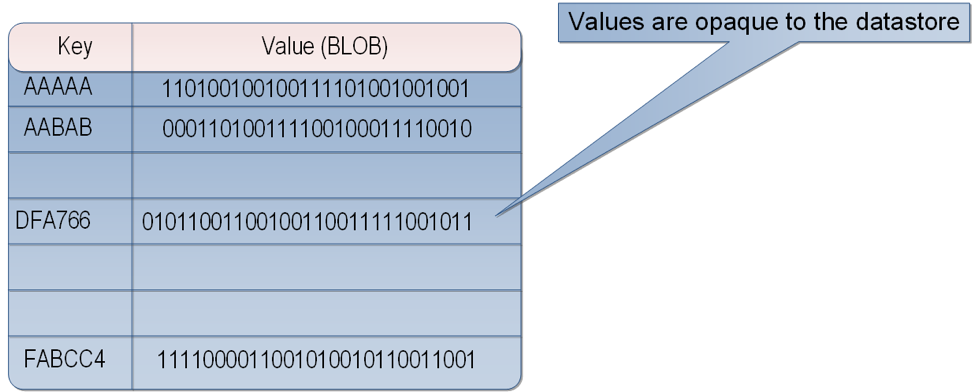
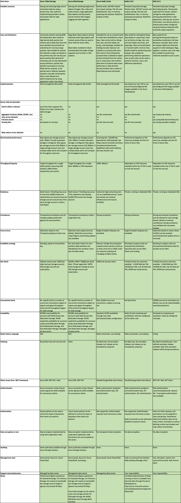
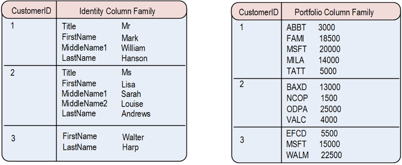
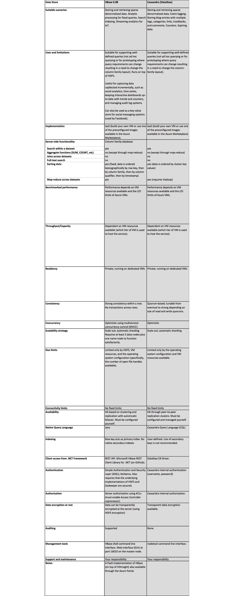
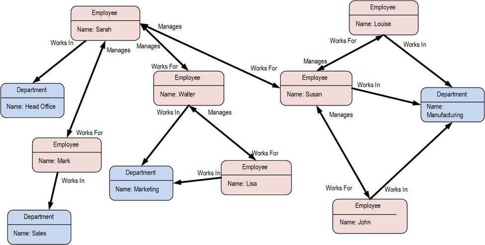
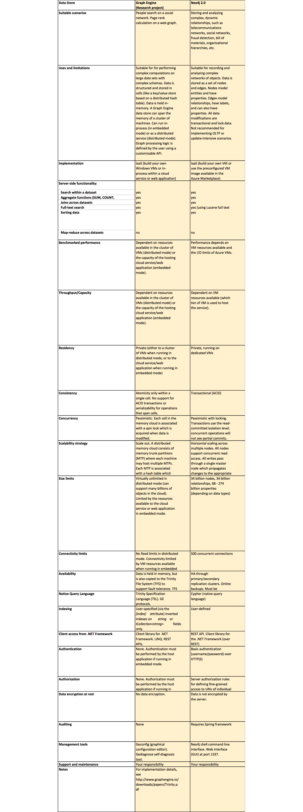
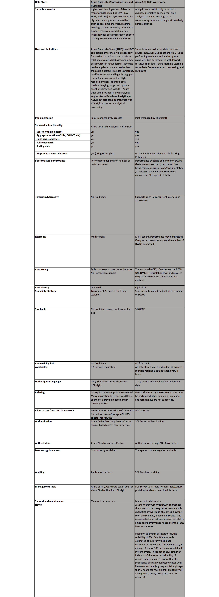
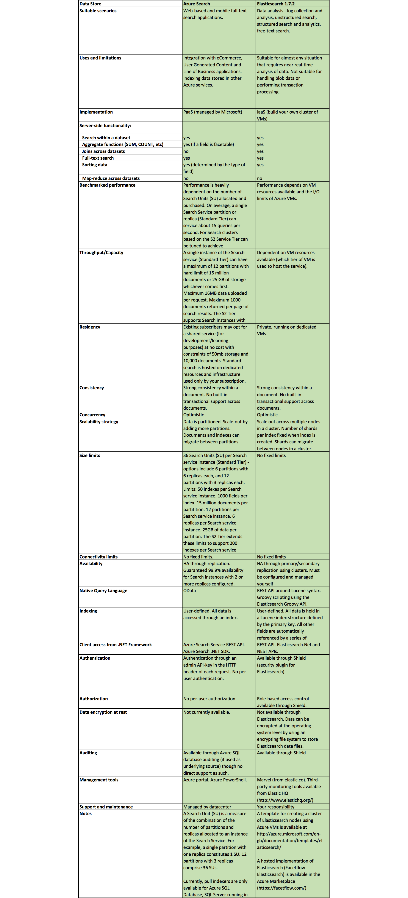
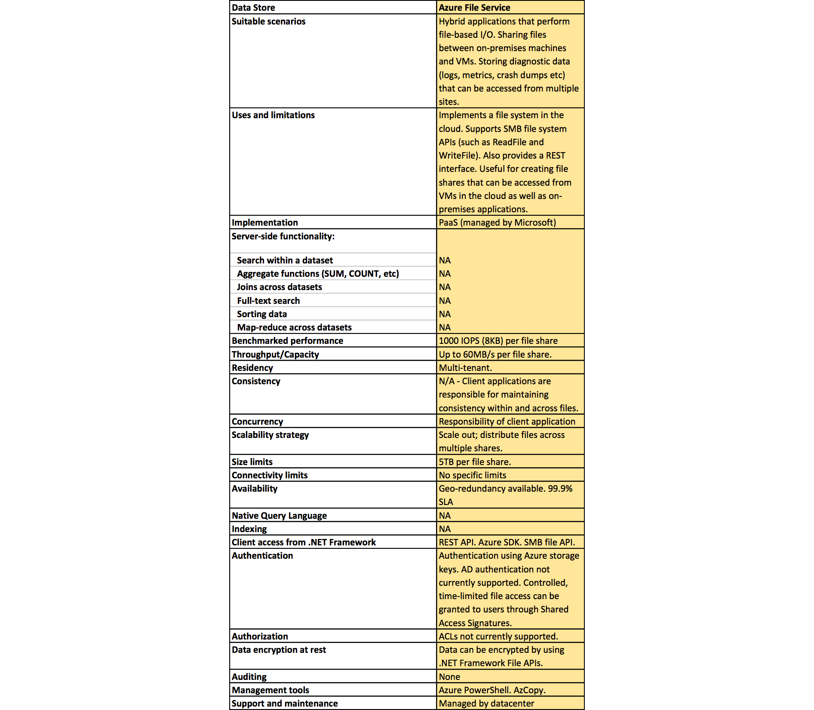

<properties
   pageTitle="Polyglot data store guidance | Microsoft Azure"
   description="Assessing Data Store Capabilities for Polyglot Solutions."
   services=""
   documentationCenter="na"
   authors="dragon119"
   manager="masimms"
   editor=""
   tags=""/>

<tags
   ms.service="best-practice"
   ms.devlang="na"
   ms.topic="article"
   ms.tgt_pltfrm="na"
   ms.workload="na"
   ms.date=""
   ms.author="masashin"/>
   
<mspnp
  file.name="best-practices-polyglot-solutions"
  publish="true"/>

# Assessing Data Store Capabilities for Polyglot Solutions

## Overview

Modern business systems make use of increasingly large volumes of data. The data might be ingested from external services, might be generated by the system itself, or could be the result of data entry by users. The nature of the data will likely vary and have differing processing requirements. For example, some data might be used to assess business trends (which products are selling well and which are not), trigger system functions (reordering goods if the product volume drops too low), analyze the performance of machinery (on an automated floor of a manufacturing plant), audit operations (such as financial transactions), or perform an entire raft of other functions. This divergence in data use and the sources of this data are often reflected in the need to hold information in different types of data stores, each focused towards a specific specialism. This is the archetypal polyglot solution.

Selecting the most appropriate set of data stores to match the various business functions is a critical design decision in most cloud applications. There are literally hundreds of implementations to choose from covering the SQL and NoSQL spaces, with more arriving each month. Data stores are frequently categorized according to the way in which they structure data and the types of operations they support; examples include relational database management systems (RDBMS), key-value stores, document databases, graph databases, column-family databases, data warehouses, search engine repositories, and even ordinary flat files.

To complicate matters further, not all data stores in a given category provide the same feature-set. Modern data stores are not necessarily simply repositories of data, but also need to provide server-side compute functionality to query and process this data. Sometimes this functionality is built into the data storage engine, but in other cases there may be a separation between the data storage and processing facilities; in these cases there may be many options for processing and analyzing information. Furthermore, different data stores support different programmatic and management interfaces, depending on the development tools in use or the administrative environment available.

To help you select the data stores most likely to meet your requirements, we have constructed a comparison chart that highlights the key features and capabilities of several leading products in the industry. We have selected technologies that are most pertinent to large-scale cloud applications, and to Azure in particular. Note that this chart is not intended to be encyclopedic, and you are not restricted to the data stores listed when building Azure applications. However, it does illustrate some of the important questions you should be asking when determining whether a given product will meet your requirements. This comparison chart categorizes data stores according to the high-level data model and pattern of use commonly associated with each. The following sections summarize these categories.

## Relational Database Management Systems (RDBMS)

Relational databases are structured around the notion of organizing data as a series of two-dimensional tables comprising rows and columns.  Each table has its own set of columns, and every row in a table has the same set of columns. This model is mathematically based, and most vendors provide a dialect of the Structured Query Language (SQL) for retrieving and managing data. RDBMSs typically implement a transactionally consistent mechanism that conforms to the ACID (Atomic, Consistent, Isolated, Durable) model for updating information. These databases are very useful for constructing systems where absolute consistency is important, but the underlying structures do not lend themselves to scaling out by distributing storage and processing across machines. Additionally, much information has to be forced into a relational structure by following the normalization process in order to store it in an RDBMS. Normalization can help to reduce redundancy and the complexity of maintaining multiple copies of the same information. However, while this process is well understood, it can lead to time-consuming processing inefficiencies when storing data due to the frequent need to disassemble logical entities into rows in separate tables, and the converse process of reassembling this data when running queries.

**Figure 1.**
Relational database management systems overview

## Key/Value Stores

A key/value store is essentially a large hash table. You associate each data value with a unique key, and the key/value store uses this key to determine where to store the data in the database by using an appropriate hashing function. The hashing function is selected to provide an even distribution of hashed keys across data storage. The values deposited in a key/value store are opaque to the storage system software - any schema information has to be provided and interpreted by the application storing or retrieving data. Essentially, values are BLOBs and the key/value store simply retrieves or stores a value by using the key provided by the application. Figure 2 illustrates a simplified conceptual view of a key/value store.

**Figure 2.**
Conceptual structure of a key/value store

Most key/value stores only support simple query, insert, and delete operations. To modify a value (either partially or completely) an application must overwrite the existing data for the entire value.

An application can store whatever data it likes as a set of values, although some key/value stores impose limits on the maximum size of values. In most implementations, reading or writing a single value is an atomic operation (if the value is large, writing may take some time). Key/value stores are highly optimized for applications performing simple lookups (based on the key), but are less suitable for creating systems that need to search for data based on non-key values, or that need to query data held across different key/value stores. A single key/value store can be extremely scalable; the underlying storage system software can easily distribute data across multiple devices located on separate machines.

**Figure 3.**
Key/value stores overview

## Document Databases
A document database is similar in concept to a key/value store except that the values stored are documents. A document is a collection of named fields and values, each of which could be simple scalar items or compound elements such as lists and child documents. The data in the fields in a document can be encoded in a variety of ways, including XML, YAML, JSON, BSON, or even stored as plain text. Unlike key/value stores, the fields in documents are exposed to the storage management system, enabling an application to query and filter data by using the values in these fields.

A typical document contains the entire data for an entity. The items that constitute an entity are application specific; for example, they could be the details of a customer, an order, or a combination of both. Compared to the RDBMS approach, a single document could contain information that might be spread across several relational tables. Additionally, a document store does not require that all documents have the same structure. This free-form approach confers great flexibility on applications, which can store different data in documents as business requirements change.

Figure 4 depicts the structure of a couple documents holding information about sales orders in a document database.

**Figure 4.**
Sales order documents in a document database

An application can query documents by using the document key. This is a unique identifier for the document, which is often hashed, to help distribute data evenly. Some document databases create the document key automatically while others enable you to specify an attribute of the document to use as the key.

You can also retrieve documents based on the value of one or more fields in a document. Some document databases support indexing to facilitate fast lookup of documents based on one or more indexed fields. Additionally, many document databases support in-place updates, enabling an application to modify the values of specific fields in a document without rewriting the entire document. Read and write operations over multiple fields in a single document are usually atomic.

**Figure 5.**
Document databases overview

## Column-Family Databases

A column-family database organizes its data into rows and columns, and in its simplest form a column-family database can appear very similar to a relational database, at least conceptually. However, the real power of a column-family database lies in its denormalized approach to structuring sparse data. You can think of a column-family database as holding tabular data comprising rows and columns, but you can divide the columns into groups known as column-families. Each column-family holds a set of columns that are logically related together and that are typically retrieved or manipulated as a unit. Other data that is accessed separately can be stored in separate column families. Figure 6 shows an example taken from a stock-broking system. Information about customers and the stocks that they own are stored in different column families. The fields in the customer Identity column family are self-explanatory, but the fields in the Portfolio column family are the tickers for each stock that the customer holds together with the volume held. The data for a single entity (a customer) that spans multiple column-families has the same row key in each column-family. This structure highlights an important benefit of the column-family approach; the rows for any given object in a column-family can vary dynamically, making this form of data store highly suited for storing structured, volatile data.

**Figure 6.**
Customer and portfolio information held as separate column-families in a column-family database

Unlike a key/value store or a document database, most column-family databases store data in key order rather than by computing a hash to determine the location. Many implementations also allow you to create indexes over specific columns in a column-family, and this feature enables you to retrieve data by referencing the values stored in the individual columns rather than the row key.

In a column-family database, read and write operations for the part of a row in a single column-family are usually atomic, although some implementations provide atomicity across the entire row (spanning multiple column-families) as well.

**Figure 7.**
Column-family databases overview

## Graph Databases

Graph database enables you to store entities, but the main focus is on the relationships that these entities have with each other. Graph databases are ideal for storing fluid, fast moving information about connections between entities. Example include social networking, telecoms message routing, and root-cause analysis.

A graph database stores two types of information; nodes that you can think of as instances of entities, and edges which specify the relationships between nodes. Nodes and edges can both have properties that provide information about that node or edge (like columns in a table). Additionally, edges can have a direction indicating the nature of the relationship.

The purpose of a graph database is to enable an application to efficiently perform queries that traverse the network of nodes and edges, and to analyze the relationships between entities. Figure 8 shows an organization's personnel database structured as a graph. The entities are the employees and the departments in the organization, and the edges indicate reporting lines and the department in which employees work. In this graph, the arrows on the edges show the direction of the relationships.

**Figure 8.**
Department and employee information in a graph database

A structure such as this makes it straightforward to conduct inquiries such as "Find all employees who directly or indirectly work for Sarah" or "Who works in the same department as John?" For large graphs with lots of entities and relationships, you can perform very complex analyses very quickly, and many graph databases provide a query language that you can use to traverse a network of relationships efficiently.

**Figure 9.**
Graph databases overview

## Parallel Data Warehouses

A parallel data warehouse (PDW) provides a massively parallel solution for ingesting, storing, and analyzing data; the data is distributed across multiple servers using a share-nothing architecture to maximize scalability and minimize dependencies. This data is unlikely to be static, so a PDW needs to be capable of handling large quantities of information arriving in a variety of formats from multiple streams at the same time as processing queries.

**Figure 10.**
Parallel data warehouses overview

## Search Engine Databases

A search engine database supports the ability to search for information held in external data stores and services. A search engine database can be used to index massive volumes of data and provide near real-time access to these indexes. Although search engine databases are commonly thought of as being synonymous with the World Wide Web, many large-scale systems are increasingly looking to them to provide structured and ad-hoc search capabilities through their own databases.

The key characteristics of a search engine database are the ability to store and index information very quickly, as well as providing extremely fast response times for search requests. Indexes can be multi-dimensional and may include support for free-text searches in large volumes of text data. The data to be indexed can be identified and uploaded either as a pull process triggered by the search engine database, or as a push process initiated by external application code.

Searching can be exact (find all documents that exactly match a given set of terms) or fuzzy (find documents that match a given set of terms and calculate how closely they match).  The database engine may also include logic that can perform linguistic analysis to return matches based on synonyms, genre expansions, and stemming. For example, the text "The sky is blue over the English Queen and her corgis" could be matched against the more poetic phrase "The firmament is a deep azure over the British monarch and her pets".

**Figure 11.**
Search engine databases overview

## Shared Files

In some circumstances, using simple flat files can be the most effective means of storing and retrieving information. Using file shares enables files to be accessed across a network. Given appropriate security and concurrent access control mechanisms, sharing data in this way can enable distributed services to provide highly scalable data access for performing basic, low-level operations such as simple read and write requests.

**Figure 12.**
Other persistence approaches
